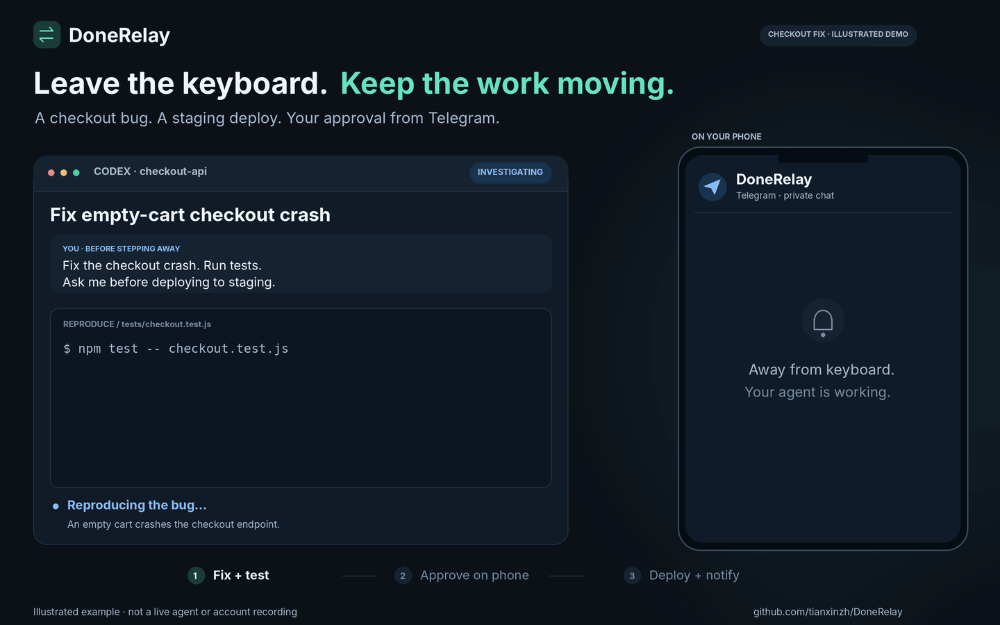

# DoneRelay — Telegram & WhatsApp notifications and remote approvals for AI agents

**Leave the keyboard. Keep the human in the loop.**

DoneRelay is an open-source, self-hosted **Node.js bridge and agent skill for Codex, Claude Code, and other AI agents**. Receive task-completion notifications, answer questions, and approve or deny a specific operation from **Telegram or WhatsApp Cloud API**. **Personal WeChat / Weixin support is experimental.**

[简体中文](README.zh-CN.md) · [Install the skill](docs/INSTALLATION.md) · [WhatsApp setup](docs/WHATSAPP.md) · [FAQ](docs/FAQ.md) · [Marketplace status](docs/MARKETPLACES.md) · [Security](SECURITY.md)



*Illustrated workflow — not a live agent or account recording. The example shows Telegram; WhatsApp uses the Cloud API setup below.* [Static version / reduced motion](docs/assets/donerelay-checkout-demo-poster.png) · [Editable demo source](scripts/render-checkout-demo.py)

> **Telegram-first prerelease candidate: 0.1.0-alpha.5.** WhatsApp code and automated tests are included; real Telegram/Codex completion, approval, and expiration have been exercised on the VPS. The [launch record](docs/LAUNCH.md) lists remaining phone tests and unvalidated channels. No official marketplace listing, npm publication, or Codex Cloud compatibility is claimed. Independent project; not endorsed by OpenAI, Anthropic, Telegram, Meta, or Tencent.

## What problem does it solve?

A long-running agent reaches a decision while you are away. Receive the exact question on your phone, reply, and let the **same still-running, integrated workflow** read the result. A completion notification closes the loop.

In the illustrated checkout example, the agent fixes an empty-cart crash and passes six fictional regression tests, then asks permission to deploy commit `8f2c91a` to staging. You approve from Telegram, the workflow checks native permissions, and only that staging operation continues. The final message reports a successful smoke check and that production was unchanged. These are scenario details, not test results for DoneRelay itself.

Chat replies are never executed as shell commands. A skill does not automatically intercept every native permission prompt or revive a terminated process.

## Compatibility and scope

| Integration | What this source includes | Important boundary |
| --- | --- | --- |
| Telegram | Notifications, direct replies, numbered commands, approve/deny buttons | Bound private user; live acceptance pending |
| WhatsApp Cloud API | Notifications, questions, approve/deny buttons or explicit text replies | Meta Business setup, HTTPS webhook, START opt-in, 24-hour reply window; live acceptance pending |
| Personal WeChat / Weixin | Experimental text transport and numbered replies | Separate authorized setup; idle-session behavior unverified |
| Codex skill | Portable SKILL.md and standalone Node client | Requires a separately running bridge |
| Native Codex runner | Experimental runner-owned App Server session | New session only; Codex 0.154.0 partial live acceptance recorded |
| Claude Code | Skill packaged as a plugin | Not native Claude permission interception or a Channels plugin |
| Other agents | Authenticated HTTP API and CLI | Caller must wait, check the result, and enforce host policy |
| Codex Cloud / arbitrary existing terminal | Not verified / no session takeover | Installation does not grant background execution or connectivity |

## Quick start: Telegram bridge

Requires **Node.js 22+** and a Telegram bot you control. No runtime npm dependencies. WhatsApp users should also follow [WhatsApp setup](docs/WHATSAPP.md); this is not a personal-account QR login.

### 1. Get the source and run checks

```sh
git clone https://github.com/tianxinzh/DoneRelay.git
cd DoneRelay
npm ci --ignore-scripts
npm test
npm run check:discovery
```

### 2. Configure credentials locally

```sh
mkdir -p ~/.config/donerelay
cp .env.example ~/.config/donerelay/bridge.env
chmod 600 ~/.config/donerelay/bridge.env
node -e "console.log(require('crypto').randomBytes(32).toString('hex'))"
```

Use that generated value for `DONERELAY_API_TOKEN`. Set `TELEGRAM_BOT_TOKEN`, `TELEGRAM_CHAT_ID`, and `TELEGRAM_USER_ID` in your private configuration. Send your bot a private message first. Inspect `chat.id` and `from.id` locally using the [Telegram Bot API](https://core.telegram.org/bots/api#getupdates); do not publish the response. A bot must not have another poller or an active webhook competing with this service.

```sh
node --env-file="$HOME/.config/donerelay/bridge.env" src/cli.js serve
```

Keep messaging credentials **outside the agent's workspace**, preferably under a separate OS user. Give the agent only the bridge URL and API token. Never commit `.env` or `data/`.

### 3. Check setup, then try a harmless question

Check the running bridge locally. This command prints only check results and guidance; it does not send messages or display secrets:

```sh
node --env-file=/secure/path/bridge.env src/cli.js doctor --bridge
```

On the agent host, configure only the bridge URL and API token, then run `donerelay doctor`. A version mismatch, missing setting, unreachable service, or rejected token exits with code 1. The [setup guide](docs/INSTALLATION.md#guided-setup-check) explains each next step.

Create `~/.config/donerelay/agent.env` privately (mode 600) with only `DONERELAY_URL=http://127.0.0.1:8787` and the same `DONERELAY_API_TOKEN`. In another terminal:

```sh
node --env-file="$HOME/.config/donerelay/agent.env" examples/request.js
```

Tap **Reply** on the Telegram question and type `SQLite`; no request ID is needed. You can also send `answer ID SQLite` using the ID in the message. This example prints the answer and exits; it does not deploy anything. Chinese replies are supported: `回答 ID 内容`, `批准 ID`, and `拒绝 ID`. “Okay” alone is not approval.

## Reply directly in Telegram

For a new question, Telegram opens its reply UI. Type your answer, such as `BLUE`, and send it. You can also tap **Reply** on the original request later. The same waiting caller receives the answer.

For an approval, use its buttons or reply to the original message with exactly `approve` or `deny` (or the corresponding command in the selected language). “Yes” and “okay” do not approve operations. Questions always produce answers, never operation approvals.

DoneRelay records the successful send's Telegram message, chat, and bot IDs and matches the incoming reply to that record. It does not infer a request from copied text or a forwarded message. Unknown targets, conflicting request IDs, unconfirmed delivery, wrong senders, expired/cancelled requests, and repeated replies cannot grant a new decision. Reply with text; media, voice notes and edits are not answers in this version. Send `/language` commands as standalone messages; when replying to a question, that text is treated as an answer.

Direct replies apply to messages sent by alpha.5 or newer. Older messages lack the stored mapping: use their numbered commands, subject to expiry and restart cancellation. The numbered commands continue to work for new messages too.

This uses Telegram's documented [message reply metadata](https://core.telegram.org/bots/api#message) and [ForceReply UI](https://core.telegram.org/bots/api#forcereply). The reply mapping is kept with the request, so the existing seven-day retention and restart cancellation rules apply.

## Choose a message language

Each request uses one language for headings, instructions, buttons, and acknowledgements. Choose in your bound Telegram chat:

- `/language en` — English.
- `/language zh` — Chinese.
- `/language auto` — let the agent choose from context, with request-text detection as the bridge fallback.
- `/language` — show the choices in the current language.

The preference is saved across restarts and applies to future requests across channels. You can also set `DONERELAY_LANGUAGE=en|zh|auto` in private configuration, pass `--language en|zh|auto` to `donerelay request` or `donerelay codex`, or include `"language":"en"` in request JSON. `donerelay preferences` reads the saved bridge preference.

Precedence: a CLI language flag overrides request JSON; request JSON overrides an agent environment default; either overrides the saved Telegram preference, which overrides the bridge environment default. An explicit `auto` delegates the choice again. The agent skill reads the preference before writing; it can choose one language from conversation context when automatic mode is selected. Without an agent choice, the bridge selects Chinese when the request message contains Han characters, otherwise English. No model or translation service runs inside the bridge.

The request stores its resolved language, so later preference changes do not relabel existing requests or their replies. Supplied task/message text, commands, and exact approval proposals are preserved; callers must write their prose in the chosen language. Both command languages are still accepted for old messages, but only the selected set is displayed.

## WhatsApp: notifications, questions, and approvals

The adapter uses **Meta's WhatsApp Business Platform Cloud API**, not WhatsApp Web automation. The sender requires a configured Meta app and business phone number; you receive and answer messages in WhatsApp on your phone.

Configure `WHATSAPP_ACCESS_TOKEN`, `WHATSAPP_PHONE_NUMBER_ID`, `WHATSAPP_BUSINESS_ACCOUNT_ID`, `WHATSAPP_USER_ID`, `WHATSAPP_APP_SECRET`, `WHATSAPP_VERIFY_TOKEN`, and a supported `WHATSAPP_GRAPH_VERSION`. Then start the bridge and point your HTTPS tunnel or reverse proxy at **port 8788**, not the private agent API on 8787. Set the Meta callback to `/webhooks/whatsapp` and subscribe to messages for your WhatsApp Business Account.

Send **START** from the bound recipient to opt in. A later **STOP** disables WhatsApp sends and decisions until a fresh START. Then try:

```sh
printf '%s' '{"kind":"question","task":"checkout-fix","message":"Should the empty-cart error say Cart is empty or Add an item first?","channels":["whatsapp"],"ttlSeconds":300}' \
  | node --env-file="$HOME/.config/donerelay/agent.env" src/cli.js request --wait
```

Reply `answer ID Cart is empty`. Approval requests use **Approve once / Deny** buttons when the full message fits the interactive limit; longer proposals stay complete text with numbered commands.

**Important:** free-form sends require an active 24-hour customer-service window. This version has **no approved-template fallback**. After the window closes, WhatsApp delivery fails explicitly; it never implies consent. Telegram can remain enabled alongside WhatsApp. See [setup, window behavior, failure codes, and live-test checklist](docs/WHATSAPP.md).

## Install in Codex or Claude Code

Installation supplies the skill; **it does not provision the bridge**.

For a local Codex skill, from the repository root:

```sh
mkdir -p ~/.agents/skills
cp -R skills/donerelay ~/.agents/skills/
```

Configure the agent's `DONERELAY_URL` and `DONERELAY_API_TOKEN` securely, then request `$donerelay` explicitly. Restart or reload the host as required by your installed version.

For Claude Code, use **DoneRelay's own catalog**, not an official directory listing:

```text
/plugin marketplace add tianxinzh/DoneRelay
/plugin install donerelay@donerelay-plugins
```

Invoke `/donerelay:donerelay` with a bounded request after setup. See [installation and smoke tests](docs/INSTALLATION.md). The root `plugin.json` and `.agents/plugins/marketplace.json` provide OpenAI plugin packaging; host-side validation remains required.

## Native Codex: start a task with remote approval handling

Install and authenticate Codex separately. With the bridge running:

```sh
node --env-file="$HOME/.config/donerelay/agent.env" src/cli.js codex \
  --cwd /absolute/path/to/your/project \
  --prompt "Inspect this project and run its tests."
```

The runner creates a **new** App Server thread with `untrusted` approval policy and `workspace-write` sandbox. It relays supported command/file approvals, non-secret structured questions, and completion notifications. It does not grant session-wide permission; oversized proposals are denied for local review. Validate against your installed Codex version before relying on it.

For native structured questions, use `donerelay codex --plan --prompt "Ask me which option to plan for."`. On Codex 0.154.0 the question tool is available in plan mode; the adapter preserves the host-selected model. Plan mode is for questions/planning, not execution.

It cannot attach to an unrelated terminal, keep a dead process alive, or recover a lost native approval after restart. The Docker image contains the bridge, not an authenticated Codex installation.

## WeChat / Weixin: experimental

The main-branch adapter uses the published [Tencent Weixin client protocol](https://github.com/Tencent/openclaw-weixin/blob/main/docs/protocol.md). This is personal Weixin, not WeCom and not a notification-only webhook. Configure your own `WEIXIN_BOT_TOKEN` and `WEIXIN_USER_ID` locally after authorized setup. This preview does not include a QR-login wizard or read another application's credential files.

Send a private message from the bound account to establish conversation context. Do not run competing consumers for the same credentials. Telegram, WhatsApp, and Weixin resolve the same request: the first valid decision wins. Weixin account eligibility, idle-session delivery, and expiry behavior need live tests. See [Weixin setup](docs/WEIXIN.md).

## HTTP API and CLI for other agents

All agent API endpoints except `/healthz` require `Authorization: Bearer <DONERELAY_API_TOKEN>`.

| Method | Path | Purpose |
| --- | --- | --- |
| POST | `/v1/requests` | Create a notification, question, or approval |
| GET | `/v1/requests/:id` | Read status and answer |
| POST | `/v1/requests/:id/cancel` | Cancel a pending request |

There is **no agent API endpoint that accepts a claimed human approval**. Decisions enter through bound channel users; WhatsApp webhooks are authenticated with Meta's raw-body signature on a separate listener.

```sh
printf '%s' '{"kind":"question","task":"storage-choice","message":"SQLite or PostgreSQL?","ttlSeconds":300}' \
  | node --env-file="$HOME/.config/donerelay/agent.env" src/cli.js request --wait
```

Choose `channels: ["telegram", "whatsapp", "weixin"]` or a configured subset; omitting channels selects all configured transports. Check request ID, proposal, delivery results, and status. `answered` is not `approved`. A `sent` delivery means the provider accepted the API call, not that the phone displayed it. WhatsApp includes a provider message ID; delivery/read receipts are not tracked.

An optional `idempotencyKey` deduplicates creation within seven days; downstream actions are not guaranteed exactly-once. A failed request is not automatically redelivered when connectivity or the WhatsApp window returns. Cancel a pending failed request and create a fresh one with a new key rather than assuming the old one was sent.

## VPS and Docker

```sh
DONERELAY_ENV_FILE="$HOME/.config/donerelay/bridge.env" docker compose up --build -d
```

The private API binds to host `127.0.0.1:8787`. Telegram and Weixin use outbound polling. **WhatsApp needs a public HTTPS callback**, routed only to its separate `127.0.0.1:8788` listener. Docker publishes both ports on host loopback; do not expose 8787 through the WhatsApp tunnel. A remote agent separately needs an authenticated, reachable bridge.

The non-root Docker bridge with persistent volume has been deployed on the validation VPS. See the launch record for its tested scope.

## Safety and failure behavior

Requests carry a random ID, complete proposal, content hash, and expiry. Only the configured user can resolve one. Timeout, failed delivery, an unknown sender, or no reply never means approval. Native host permissions remain in force.

WhatsApp verifies raw-body HMAC signatures, the business account, business phone number, and sender. Consent, replay markers, and valid decisions are written atomically before the webhook acknowledges receipt. Repeated callbacks cannot resolve the same request twice. Invalid replies are ignored; the calling agent reads the stored result. WhatsApp does not send an additional acknowledgement bubble for every chat message in this preview.

**Main-branch behavior:** pending requests are cancelled after restart. Existing decisions are not automatically executed. Local state is plaintext with private file permissions and seven-day completed-request retention. One process owns a state file. After a crash, a stale `.lock` blocks startup; verify the old process has stopped before removing it. Same-user host compromise is outside this isolation model.

Read [SECURITY.md](SECURITY.md), [privacy and data flow](PRIVACY.md), and [FAQ](docs/FAQ.md) before sensitive use.

## Distribution, roadmap, and contributions

[Marketplace research](docs/MARKETPLACES.md) explains OpenAI submission and Claude community-versus-official routes. [Submission materials](docs/SUBMISSION.md) contain draft listing copy, reviewer scenarios, and release gates. Local catalogs do not confer approval or endorsement.

Next gates: real Telegram/WhatsApp acceptance, an approved WhatsApp template workflow for longer idle periods, Weixin login/idle-session validation, native Codex compatibility, clean-host plugin installation, and owner-reviewed publication. There is no published npm install command to advertise yet.

Issues, reproducible tests, and small pull requests are welcome. A star helps people bookmark the project; reporting a tested host version or a reproducible setup problem is especially useful. No manufactured installs, stars, or ranking claims.

[MIT license](LICENSE) · [Contributing](CONTRIBUTING.md) · [Changelog](CHANGELOG.md)

## Launch evidence

The [launch record](docs/LAUNCH.md) separates real VPS/host checks from automated fixtures and lists decisions still needed. Main is the supported implementation; pending requests are cancelled on restart. PR #2 is an alternative design and must not be mixed with this client or service.
